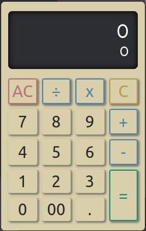

<!--
*** Thanks for checking out the Best-README-Template. If you have a suggestion
*** that would make this better, please fork the repo and create a pull request
*** or simply open an issue with the tag "enhancement".
*** Thanks again! Now go create something AMAZING! :D
-->

<!-- PROJECT SHIELDS -->
<!--
*** I'm using markdown "reference style" links for readability.
*** Reference links are enclosed in brackets [ ] instead of parentheses ( ).
*** See the bottom of this document for the declaration of the reference variables
*** for contributors-url, forks-url, etc. This is an optional, concise syntax you may use.
*** https://www.markdownguide.org/basic-syntax/#reference-style-links
-->

<!-- PROJECT LOGO -->
 

  

  <h3 align="center">Calculator</h3>

  

  A web version of a calculator! Made for The Odin Project  

  <h3>
    <a target="_blank" href="https://bluechai03.github.io/calculator/">
      Demo
    </a>
     | 
    <a target="_blank" href="https://github.com/Bluechai03/calculator">
      Solution
    </a>
  </h3>
  

<!-- TABLE OF CONTENTS -->

  
Table of Contents

  <ol>
    <li>
      <a href="#about-the-project">About The Project</a>
      <ul>
        <li><a href="#built-with">Built With</a></li>
      </ul>
    </li>
    <li><a href="#contact">Contact</a></li>
    <li><a href="#acknowledgements">Acknowledgements</a></li>
  </ol>

<!-- ABOUT THE PROJECT -->

## About The Project

You can string multiple operations together. Also, keyboard inputs are supported! All logic was created using Vanilla JavaScript and SCSS as the preprocessor for CSS.

For this project I focused on the logic and made sure everything functioned well without any hindering bugs. Compared to my other projects, I didn't spend much of my time making it look perfect. There were tons of bugs I had to fix and I tried my best to solve it myself and not search for an answer right away so I did have to spend most of my time using chrome's debugger tool to debug and it was incredibly helpful.

### Features

- Ability to calculate multiple strings of operations
- Add, subtract, multiply and divide values
- Remove a value or clear the calculator
- Keyboard support

### Built With

- [SCSS](https://sass-lang.com/)
- [JavaScript](https://developer.mozilla.org/en-US/docs/Web/JavaScript)

<!-- CONTACT -->

## Contact

Anna Montero - [Bluechai03](https://github.com/Bluechai03) - montero.katreena@gmail.com

Project Link: [https://github.com/Bluechai03/etch-a-sketch](https://github.com/Bluechai03/etch-a-sketch)

<!-- ACKNOWLEDGEMENTS -->

## Acknowledgements

- [Best-README-Template](https://github.com/othneildrew/Best-README-Template)
- [The Odin Project](https://www.theodinproject.com/dashboard)
- [Figma](https://figma.com)
- [Coolors.co](https://coolors.co)
- [Haikei](https://app.haikei.app/)
- [Dribbble](https://dribbble.com)
